# Pluto — Local-First Personal AI Assistant

A production-grade personal AI assistant that runs **entirely on your machine** — no cloud, no API keys, no data leaving your device.

Built with **OpenAI Agents SDK**, **Ollama**, **FastAPI**, and **Tauri + React**. Designed for privacy, low latency, and offline-first use.

---

## Architecture

<p align="center">
  
</p>

---

## Features

| Feature | Details |
|---|---|
| **Single agent, all tools** | One Pluto agent with tool groups scoped per intent — no handoff overhead |
| **Streaming responses** | SSE token-by-token delivery with tool call visibility |
| **Hybrid routing** | Deterministic slash commands + LLM routing for ambiguous requests |
| **Persistent memory** | FTS5-indexed SQLite facts injected into every system prompt |
| **Context compaction** | Parallel fact extraction + summarisation when history overflows |
| **Calendar** | Natural language scheduling, proactive 24h event context injection |
| **Notes** | Structured markdown notes with YAML front matter, SQLite index |
| **Tasks** | Kanban-style task management with categories |
| **Budget** | Transaction tracking, savings goals, monthly summaries |
| **Slides** | Marp PDF presentations from natural language outlines |
| **Diagrams** | Mermaid diagram generation |
| **Obsidian sync** | Dashboard, kanban, calendar, budget, and weekly plan vault pages |
| **Voice mode** | VAD + local TTS for hands-free interaction |
| **File attachments** | Images (multimodal), PDFs (OCR), and plain text |
| **100% local** | Zero cloud calls — Ollama + SQLite + local filesystem |

---

## Slash Commands

| Command | Aliases | What it does |
|---|---|---|
| `/note` | `/notes` | Create or manage notes |
| `/slides` | `/slide` | Generate a Marp PDF presentation |
| `/calendar` | `/schedule`, `/event` | Schedule or list events |
| `/task` | `/tasks` | Create or manage tasks |
| `/budget` | — | Log transactions, check summaries, manage savings goals |
| `/diagram` | — | Generate a Mermaid diagram |
| `/dashboard` | `/obsidian`, `/vault` | Sync Obsidian vault pages |
| `/remember` | `/memory` | Store a personal fact |
| `/forget` | — | Delete a stored fact |

Without a slash command, the agent decides how to handle the request based on context.

---

## Design Decisions

### 1. Single agent with scoped tool groups
Rather than routing between specialist agents via handoffs, Pluto uses one agent with tool groups. Each slash command activates a relevant subset of tools, keeping context tight without sacrificing capability.

### 2. Hybrid routing — fast AND flexible
Slash commands deterministically bypass LLM routing for known intents. Unknown or ambiguous requests go through the agent with the full tool set. This gives sub-100ms routing for common tasks while preserving flexibility.

### 3. Context compaction with parallel fact extraction
When conversation history approaches the model's context window, the compactor runs two parallel LLM calls: one to summarise old messages, one to extract durable facts into permanent memory. The conversation continues seamlessly without losing long-term information.

### 4. Local-first architecture
Every component — LLM inference (Ollama), storage (SQLite), file storage — runs on-device. Privacy is guaranteed by design, not policy.

### 5. Streaming SSE with tool visibility
The `/chat/stream` endpoint emits structured SSE events: `token` (text delta), `tool_call` (tool name + args), and `done` (metadata). The frontend renders all of this in real time.

### 6. Memory as flat injection (not RAG)
Personal facts are stored in SQLite and injected verbatim into every system prompt. No embedding overhead — the full fact store fits in context for a personal assistant.

### 7. Proactive calendar context
The system prompt is augmented with events starting in the next 24 hours before every turn. No tool call needed — the model knows about upcoming commitments automatically.

---

## Quickstart

### Prerequisites

- [Ollama](https://ollama.com) installed and running
- Python 3.11+
- Node.js 18+ (for Marp CLI, optional)
- [Rust + Tauri CLI](https://tauri.app) (for desktop app)

### Backend

```bash
cd backend

# Copy and configure
cp config.example.json config.json
# Edit config.json: set your Ollama model and other preferences

# Install dependencies
pip install -r requirements.txt

# Pull the LLM model
ollama pull qwen2.5:3b

# (Optional) Install Marp for slide generation
npm install -g @marp-team/marp-cli

# Start
python main.py
```

### Desktop App (Tauri)

```bash
cd frontend
npm install
npm run tauri dev      # dev mode
npm run tauri build    # production build → installers in src-tauri/target/release/bundle/
```

### Docker (backend only)

```bash
make dev                                              # build + start
docker compose exec ollama ollama pull qwen2.5:3b     # pull model once
curl http://localhost:8000/health                     # 200 = ready
```

---

## API Reference

### Chat

```
POST /chat
  Form: message (str), session_id (str, optional), attachments (files, optional)
  Response: { response, tools_used, agents_trace, file_url, attachments }

POST /chat/stream
  Form: message (str), session_id (str, optional)
  Response: text/event-stream
    event: token      data: {"delta": "..."}
    event: tool_call  data: {"tool": "...", "arguments": "..."}
    event: done       data: {"response": "...", "tools_used": [...]}
    event: error      data: {"message": "..."}
```

### Sessions

```
POST   /sessions              → create session, returns session_id
GET    /sessions              → list all sessions
GET    /sessions/{id}/messages → full history for session
DELETE /sessions/{id}         → delete session
```

---

## Repository Structure

```
personal_ai/
├── backend/
│   ├── main.py                    # FastAPI app — lifespan, CORS, error handlers
│   ├── config.json                # All hyperparameters
│   ├── config.example.json        # Safe-to-commit template (no secrets)
│   ├── requirements.txt
│   ├── Dockerfile
│   │
│   ├── agent/
│   │   └── single.py              # Singleton Pluto agent — all tools registered here
│   │
│   ├── tools/                     # @function_tool wrappers only (no business logic)
│   │   ├── budget.py
│   │   ├── calendar.py
│   │   ├── diagrams.py
│   │   ├── memory_tools.py
│   │   ├── notes.py
│   │   ├── obsidian.py
│   │   ├── slides.py
│   │   ├── tasks.py
│   │   ├── vault_files.py
│   │   └── web_search.py
│   │
│   ├── helpers/
│   │   ├── core/                  # config_loader, db, logger, exceptions
│   │   ├── agents/
│   │   │   ├── execution/         # ollama_client, runner, event parsing
│   │   │   ├── routing/           # message_builder, command_parser, prompt_utils
│   │   │   └── session/           # SQLite session store, compaction, token counter
│   │   └── tools/                 # All tool logic as plain callables
│   │
│   ├── handlers/                  # text_handler, file_handler
│   ├── routes/                    # FastAPI routers (messaging, stream, sessions, files, auth, settings)
│   ├── models/                    # Pydantic schemas
│   ├── instructions/agents/       # System prompts as .md files
│   └── tests/
│       ├── unit/                  # Fast, offline, mocked LLM
│       └── e2e/                   # Require running Ollama
│
└── frontend/
    └── src/
        ├── App.jsx                # Layout shell — shared state + composition
        ├── api.js                 # Single API client — every backend call lives here
        ├── components/            # Header, Sidebar, ChatArea, ChatFooter, SettingsPanel
        └── hooks/                 # useAuth, useChat, useSessions, useVoice, useTTS, useFileDrop
```

---

## Running Tests

```bash
cd backend
pytest                   # all tests (requires Ollama for e2e)
pytest -m "not e2e"      # unit tests only — fully offline, no Ollama needed
```
