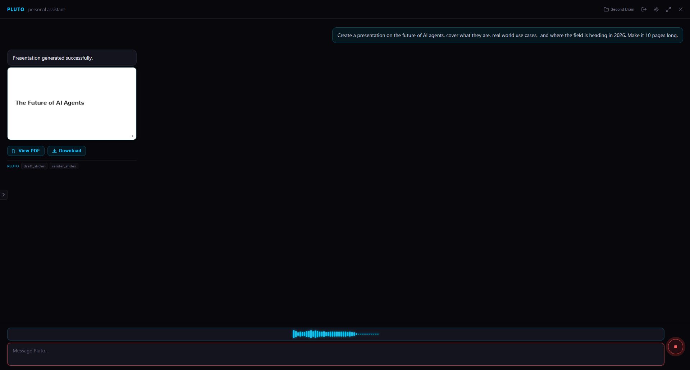

# Pluto — Local-First Personal AI Assistant

> A fully offline personal AI assistant. No cloud. No API keys. No data leaving your machine.

[](https://youtu.be/YiwhxyF8KDs)

Built on **Ollama**, **OpenAI Agents SDK**, **FastAPI**, and **Tauri + React**. Pluto runs entirely on your hardware — LLM inference, memory, calendar, tasks, budget, and voice all stay local.

---

## What it does

- **Chat** with a local LLM (Qwen, Llama, Mistral, or any Ollama model) via a native desktop app
- **Remember things** — facts you share are stored and injected into every conversation
- **Schedule events** — natural language calendar management with 24h proactive context
- **Manage tasks** — create, update, and complete tasks with categories
- **Track budget** — log income/expenses, savings goals, and monthly summaries
- **Take notes** — structured markdown notes with YAML front matter, indexed in SQLite
- **Generate slides** — Marp PDF presentations from natural language outlines
- **Draw diagrams** — Mermaid diagram generation
- **Search the web** — local agent with web search capability
- **Voice mode** — mic input (Faster-Whisper STT) + local TTS
- **Attach files** — images (multimodal), PDFs (OCR), and plain text

---

## Stack

| Layer | Tech |
|---|---|
| LLM inference | [Ollama](https://ollama.com) — runs any local model |
| Agent framework | OpenAI Agents SDK |
| Backend | FastAPI + SQLite |
| Desktop app | Tauri v2 + React 18 + Vite |
| Speech-to-text | Faster-Whisper (local) |
| Text-to-speech | Local TTS |
| Auth | Single-user JWT (bcrypt, 15 min access / 7 day refresh) |

---

## Architecture

```
User message
  └─► FastAPI /chat/stream
        └─► message_builder   (slash command detection, memory injection, history windowing)
              └─► Pluto agent  (single agent, scoped tool group per intent)
                    └─► SSE stream  →  frontend token-by-token rendering
```

Slash commands bypass LLM routing entirely — they activate a pre-scoped tool group directly, saving one full inference round-trip.

---

## Slash Commands

| Command | Aliases | What it does |
|---|---|---|
| `/note` | `/notes` | Create or search notes |
| `/slides` | `/slide` | Generate a Marp PDF presentation |
| `/calendar` | `/schedule`, `/event` | Schedule or list events |
| `/task` | `/tasks` | Create or manage tasks |
| `/budget` | — | Log transactions, summaries, savings goals |
| `/diagram` | — | Generate a Mermaid diagram |
| `/remember` | `/memory` | Store a personal fact |
| `/forget` | — | Delete a stored fact |
| `/search` | `/web` | Search the web |

Without a slash command, the agent decides which tools to use based on context.

---

## Quickstart

### Prerequisites

- [Ollama](https://ollama.com) installed and running
- Python 3.11+
- Node.js 18+
- [Rust + Tauri CLI](https://tauri.app) (for the desktop app)

### 1 — Backend

```bash
cd backend

# Configure
cp config.example.json config.json
# Edit config.json — set your model name and preferences

# Install
pip install -r requirements.txt

# Pull the model (or use any model you already have)
ollama pull qwen2.5:3b

# (Optional) Install Marp for slide generation
npm install -g @marp-team/marp-cli

# Run
python main.py
# → API running at http://localhost:8000
```

### 2 — Desktop App

```bash
cd frontend
npm install
npm run tauri dev        # dev mode with hot reload
npm run tauri build      # production build → installers in src-tauri/target/release/bundle/
```

### Docker (backend only)

```bash
make dev                                              # build + start
docker compose exec ollama ollama pull qwen2.5:3b     # pull model once
curl http://localhost:8000/health                     # 200 = ready
```

---

## API

### Chat

```
POST /chat
  Form: message (str), session_id (str, optional), attachments (files, optional)
  Returns: { response, tools_used, agents_trace, attachments }

POST /chat/stream
  Form: message (str), session_id (str, optional)
  Returns: text/event-stream
    event: token      data: { "delta": "..." }
    event: tool_call  data: { "tool": "...", "arguments": "..." }
    event: done       data: { "response": "...", "tools_used": [...] }
    event: error      data: { "message": "..." }
```

### Sessions

```
POST   /chat/session                      → create session
GET    /chat/sessions                     → list all sessions
GET    /chat/session/{id}/messages        → full message history
DELETE /chat/session/{id}                 → delete session
```

### Other

```
POST /transcribe      → transcribe an audio file (Faster-Whisper)
GET  /settings/models → list available Ollama models
```

---

## Repository Structure

```
personal_ai/
├── backend/
│   ├── main.py                    # FastAPI app — lifespan, CORS, error handlers
│   ├── config.json                # All hyperparameters (model, paths, auth, etc.)
│   ├── config.example.json        # Safe-to-commit template
│   │
│   ├── agent/
│   │   └── single.py              # Singleton Pluto agent — all tools registered here
│   │
│   ├── tools/                     # @function_tool wrappers only (zero business logic)
│   │   ├── budget.py
│   │   ├── calculator.py
│   │   ├── calendar.py
│   │   ├── diagrams.py
│   │   ├── memory_tools.py
│   │   ├── notes.py
│   │   ├── reminders.py
│   │   ├── slides.py
│   │   ├── tasks.py
│   │   └── web_search.py
│   │
│   ├── helpers/
│   │   ├── core/                  # config_loader, db, logger, exceptions
│   │   ├── agents/
│   │   │   ├── execution/         # ollama_client, runner, event_parser
│   │   │   ├── routing/           # message_builder, command_parser, prompt_utils
│   │   │   └── session/           # SQLite session store, compaction, token counter
│   │   └── tools/                 # All tool business logic as plain callables
│   │
│   ├── handlers/                  # text_handler, file_handler
│   ├── routes/                    # FastAPI routers
│   ├── models/                    # Pydantic schemas
│   ├── instructions/agents/       # System prompts as .md files (never inlined in Python)
│   └── tests/
│       ├── unit/                  # Fast, offline, mocked LLM
│       └── e2e/                   # Require running Ollama  (@pytest.mark.e2e)
│
└── frontend/
    └── src/
        ├── App.jsx                # Layout shell — shared state + composition
        ├── api.js                 # Single API client — every backend call lives here
        ├── components/            # Header, Sidebar, ChatArea, ChatFooter, SettingsPanel, VoiceOverlay
        └── hooks/                 # useAuth, useChat, useSessions, useVoice, useTTS, useFileDrop
```

---

## Design Notes

**Single agent, scoped tool groups** — Rather than routing between specialist agents via handoffs, Pluto uses one agent with tool groups scoped per intent. Slash commands activate a small relevant subset; unknown intents get the full set. This keeps the context tight without sacrificing capability.

**Hybrid routing** — Slash commands deterministically bypass LLM routing. Ambiguous requests go through the agent. Sub-100ms routing for common tasks, full flexibility for everything else.

**Memory as flat injection** — Personal facts are stored in SQLite FTS5 and injected verbatim into every system prompt. No embeddings, no vector search — the full fact store fits in context for a personal assistant use case.

**Context compaction** — When conversation history approaches the model's context window, the compactor runs two parallel LLM calls: one to summarise old messages, one to extract durable facts into permanent memory. Conversation continues seamlessly.

**Proactive calendar context** — Events starting in the next 24 hours are injected into the system prompt on every turn. No tool call needed — the model already knows about upcoming commitments.

**Streaming with tool visibility** — The `/chat/stream` endpoint emits structured SSE events: `token`, `tool_call`, and `done`. The frontend renders tool calls in real time so you can see what the agent is doing.

---

## Tests

```bash
cd backend

pytest                   # all tests (requires Ollama for e2e)
pytest -m "not e2e"      # unit tests only — fully offline, no model needed
```

---

## License

MIT
